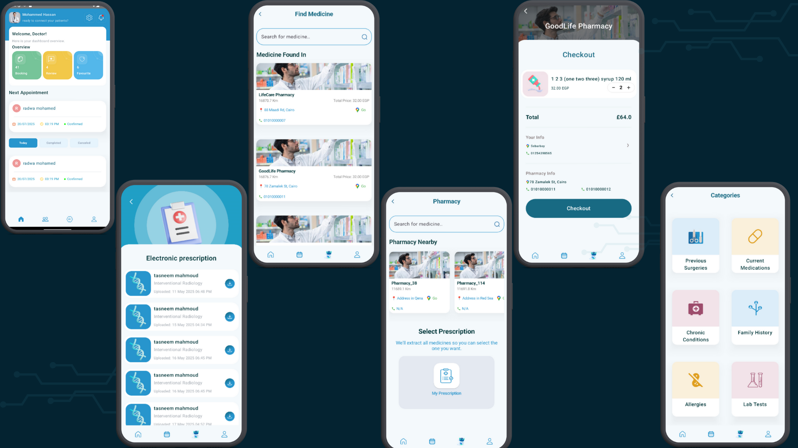

# Balto – Smart Platform for Comprehensive Medical Management

Balto is a full-stack, role-based medical platform designed to streamline interactions between patients, doctors, secretaries, and pharmacies. Built with scalability, security, and user-centric design in mind, Balto brings together modern web and mobile technologies to support smarter healthcare delivery.

---

## 📸 Screenshots

| Patient Dashboard | Doctor Dashboard |
|-------------------|------------------|
|  |  |

| Pharmacy Dashboard|  Secretaries Dashboard| 
|-------------------|-------------------
|  | |
---
## 🩺 Project Overview
Balto is tailored to meet the specific needs of different user roles:

### 👨‍⚕️ Doctors
- Manage daily schedules and avoid conflicts
- Create and send digital prescriptions
- View structured patient medical history
- Customize clinic profile and availability

### 👨‍💼 Patients
- Book appointments based on specialty, location, and availability
- Access full medical history, including diagnoses, lab results, and prescriptions
- Interact with AI tools like chat assistant, heart rate monitor, and CBC interpretation

### 👩‍💼 Secretaries
- Manage walk-ins, reschedule, and cancel appointments
- Control real-time queue and notify patients of status changes
- Handle emergency appointments and clinic flow

### 💊 Pharmacies
- Manage medicine stock with real-time tracking and expiry alerts
- View and filter prescription orders by date/status
- Visualize top-selling items and restock needs

---

## 📱 Mobile Application

An Android version of the platform is available:

[Download APK](./Balto-Mobile.apk)

---

## 🔧 Technologies Used

- ASP.NET Core, Entity Framework, SQL Server
- LINQ, Clean Architecture (Onion)
- SignalR for real-time updates
- Firebase for mobile notifications
- Microsoft Azure (Web & Blob Storage)
- JWT Authentication & Role-Based Access
- Git & GitHub for version control
- Postman & Swagger for API documentation
- Jira for project management

---

## 📄 API Documentation

Explore the API endpoints and test live using Postman:

👉 [API Documentation (Postman)](https://documenter.getpostman.com/view/40213053/2sAYX6pgzg)

---

## 👥 Contributors

### Backend Developers
- Mohamed Belal
- Mohamed Hazem
- Ibrahim Tamer
- Mohamed Gad

### Mobile Developers
- Tasneem Rizk
- Radwa Mohamed

### AI Developer
- Isra Omera

### Testing & QA
- Ahmed Rashad

---

## 🔗 Useful Links
- 💊 Pharmacy Dashboard: [Click Here](https://balto-pharmacy.azurewebsites.net/)
- 👨‍💻 Secretary Dashboard: [Click Here](https://balto-secretary.azurewebsites.net/)
- 📱 Mobile App APK: [Balto-Mobile.apk](./Balto-Mobile.apk)
- 🎓 Project Presentation: [Balto Presentation](https://www.canva.com/design/DAGwsacgbRI/pQ_-0zANTS17urQlTwy5ag/view?utm_content=DAGwsacgbRI&utm_campaign=designshare&utm_medium=link2&utm_source=uniquelinks&utlId=h630fd0260f)
- 📘 Documentation: [Postman Docs](https://documenter.getpostman.com/view/40213053/2sAYX6pgzg)

---

## 📥 How to Run

1. Clone the repository
2. Navigate to `Balto.Web` for the backend and frontend web client
3. Use Visual Studio or VS Code and configure `appsettings.json` as per your environment
4. Run the database migrations
5. Run the application and explore role-based dashboards

