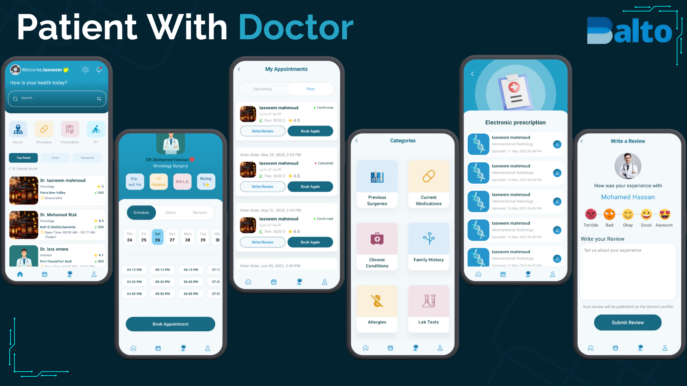
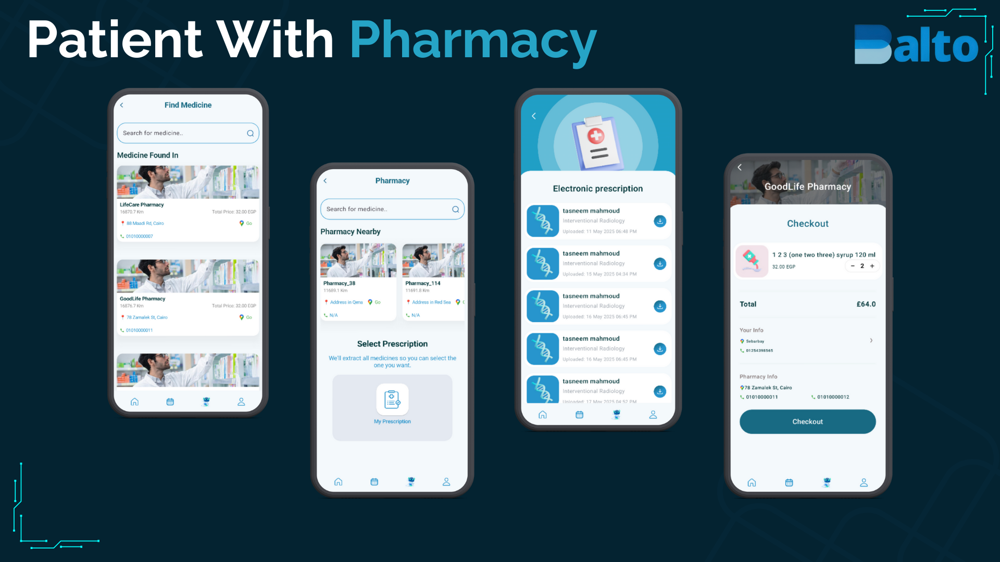
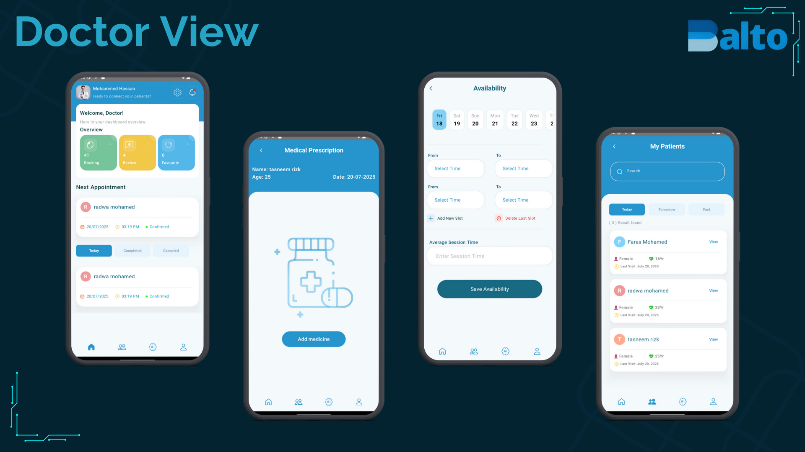
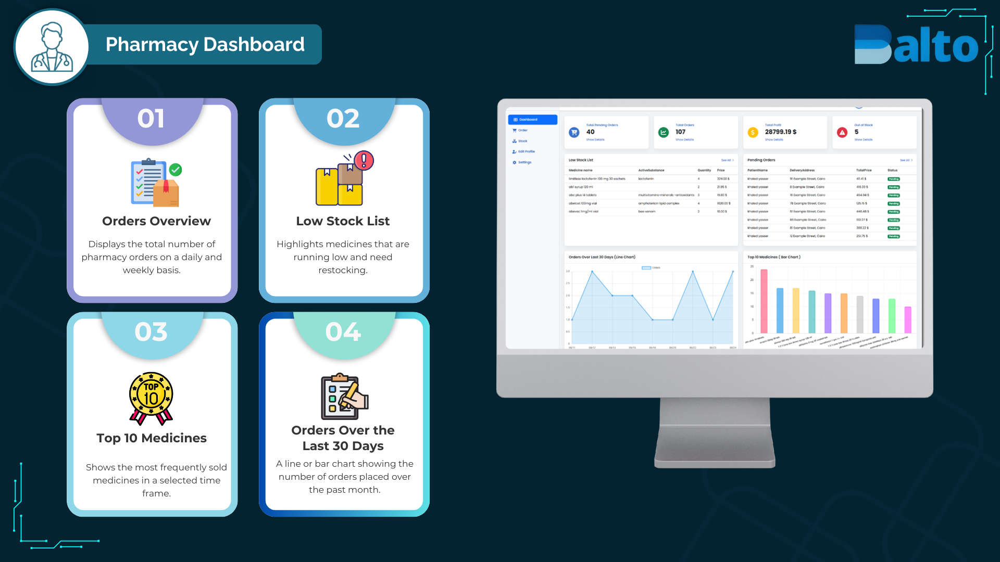
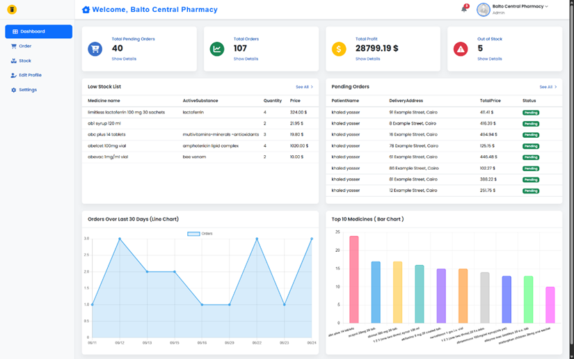
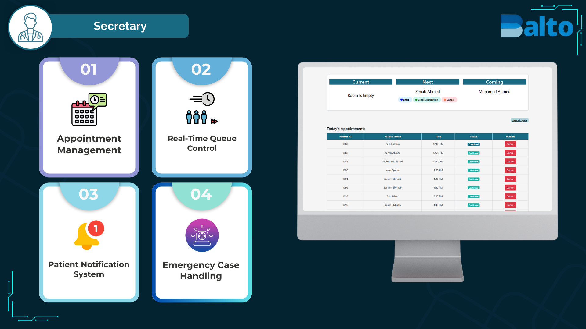

### *<h1 align="center">✨Balto – Smart Platform for Comprehensive Medical Management✨</h1>*
Balto is a full-stack, role-based medical platform designed to streamline interactions between patients, doctors, secretaries, and pharmacies. Built with scalability, security, and user-centric design in mind, Balto brings together modern web and mobile technologies to support smarter healthcare delivery.

## ✨ Features

| Role | Key Features |
|------|--------------|
| 👨‍⚕️ Doctors | - Manage daily schedules & avoid conflicts   - Create & send digital prescriptions   - View structured patient medical history   - Customize clinic profile & availability |
| 👨‍💼 Patients | - Book appointments by specialty, location & availability   - Access complete medical history (diagnoses, lab results, prescriptions)   - AI-powered tools: chat assistant, heart rate monitor, CBC interpretation   - Request medicine orders directly from pharmacies & get nearest 10 pharmacies (based on location) where the medicine is available |
| 👩‍💼 Secretaries | - Manage walk-ins, reschedule & cancel appointments   - Real-time queue control & patient notifications   - Handle emergency appointments & manage clinic flow |
| 💊 Pharmacies | - Manage medicine stock with expiry alerts   - Real-time stock tracking & inventory management   - Filter prescription orders by date/status   - Visualize top-selling items & restock needs |

***
## 📸 Screenshots

| Patient With Doctor | Patient With Pharmacy |
|-------------------|------------------|
|  |  |

| Doctor View |
|-------------------|
|  |

| Pharmacy Dashboard | Dashboard| 
|-------------------|-------------------|
|  |  |

|  Secretaries Dashboard| 
|-------------------|
|  |

***
## 🩺 Project Overview
Balto is tailored to meet the specific needs of different user roles:

### 👨‍⚕️ For Doctors
- Full control over schedules, appointments, and availability  
- Create, track, and send **digital prescriptions** directly to patients and pharmacies  
- Access structured **patient medical history** for better decision-making  
- Manage clinic profile and handle emergency cases with flexibility  

### 👨‍💼 For Patients
- Search and book appointments by specialty, location, or doctor availability  
- Access a **complete medical history** including lab results, diagnoses, and prescriptions  
- Use **AI-powered tools** such as a chat assistant, heart rate monitor, and CBC interpretation  
- Order medicines directly from the system and instantly get the **nearest 10 pharmacies** where the drug is available  
- Receive real-time updates and notifications about appointments or prescriptions  

### 👩‍💼 For Secretaries
- Streamlined management of **walk-ins, cancellations, and reschedules**  
- Real-time queue monitoring with patient notifications  
- Handle emergency or priority cases while maintaining smooth clinic flow  
- Reduce errors and save time with automated updates and reminders  

### 💊 For Pharmacies
- **Real-time stock management** with expiry alerts and notifications  
- Receive digital prescriptions instantly from doctors and patients  
- Track orders and filter them by date, doctor, or status  
- Visualize **top-selling items** and restock efficiently  
- Improve patient service by fulfilling medicine requests quickly  

***
## 📱 Mobile Application
An Android version of the platform is available:

[Download APK](./Balto-Mobile.apk)

***
## 🔧 Technologies Used

- ASP.NET Core, Entity Framework, SQL Server
- LINQ, Clean Architecture (Onion)
- SignalR for real-time updates
- Firebase for mobile notifications
- Microsoft Azure (Web & Blob Storage)
- JWT Authentication & Role-Based Access
- Git & GitHub for version control
- Postman & Swagger for API documentation
- Jira for project management

***
## 📄 API Documentation

Explore the API endpoints and test live using Postman:

👉 [API Documentation (Postman)](https://documenter.getpostman.com/view/40213053/2sAYX6pgzg)

***
## 🔗 Useful Links
- 💊 Pharmacy Dashboard: [Click Here](https://balto-pharmacy.azurewebsites.net/)
- 👨‍💻 Secretary Dashboard: [Click Here](https://balto-secretary.azurewebsites.net/)
- 📱 Mobile App APK: [Balto-Mobile.apk](./Balto-Mobile.apk)
- 🎓 Project Presentation: [Balto Presentation](https://www.canva.com/design/DAGwsacgbRI/pQ_-0zANTS17urQlTwy5ag/view?utm_content=DAGwsacgbRI&utm_campaign=designshare&utm_medium=link2&utm_source=uniquelinks&utlId=h630fd0260f)
- 📘 Documentation: [Postman Docs](https://documenter.getpostman.com/view/40213053/2sAYX6pgzg)

***
## 📥 How to Run

1. Clone the repository
2. Navigate to `Balto.Web` for the backend and frontend web client
3. Use Visual Studio or VS Code and configure `appsettings.json` as per your environment
4. Run the database migrations
5. Run the application and explore role-based dashboards

***

## 🧑‍💻Authors

### Backend Developers
- [Mohammed Hassan](https://www.linkedin.com/in/mohammed-bder/)
- [Mohammed Belal](https://www.linkedin.com/in/mohamed-belall/)
- [Mohammed Hazem](https://www.linkedin.com/in/mohamed-hazem-1bb4b1231/)
- [Mohammed Alaa](https://www.linkedin.com/in/mohamed-gad-eng/)
- [Ibrahim Tamer](https://www.linkedin.com/in/ibrahem-elkhatib/)

### Mobile Developers
- Tasneem Rizk
- Radwa Mohamed

### AI Developer
- Isra Omera

### Testing & QA
- Ahmed Rashad

***
## 📝Feedback

If you have any feedback, please reach out to us at MelioTech@gmail.com

## ⚖️License

[MIT](https://choosealicense.com/licenses/mit/)
